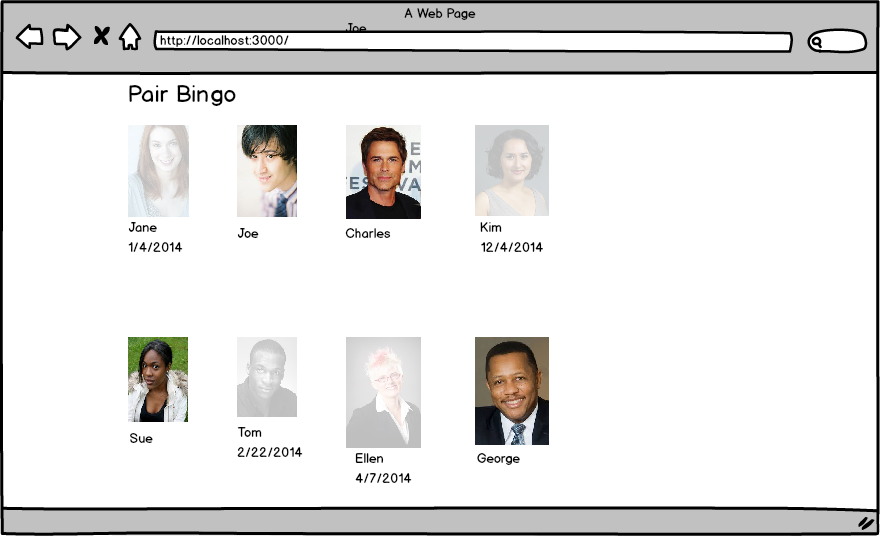
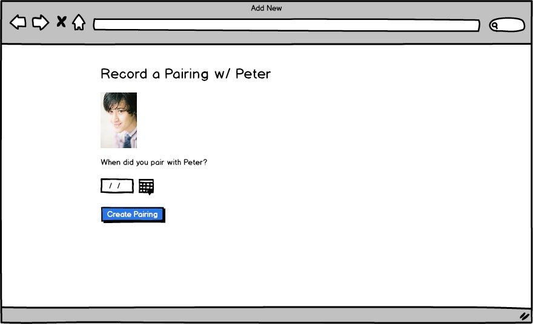

# Rails Practice - Pair Bingo

## Setup

* `bundle`
* `rake db:create db:migrate db:seed`
* `rails s`

You can run specs with:

* `rspec`

Note: email/password combinations for existing users populated by `rake db:seed` can be found in the db/seeds.rb file.

## Stories

**Users can track who they've paired with**

```
As a user
When I login
And I click on the image of a colleague
Then I should be able to enter a date when I paired with them
(And I must enter a date)
And when I create the pairing then their image should appear grayed out
And the date I paired with the person should appear underneath the picture
```

**If you've already paired with a person, their picture should not be clickable**

```
As a user
When I login
And I have already paired with people
Then their grayed-out pictures should not be clickable
```

**Users cannot enter a date in the future**

```
When I go to create a pairing
Then I should not be able to enter a date in the future
```

**When you pair with someone, the picture should appear grayed out and unclickable for them as well**

```
As a user
When I login
And somebody else marked that they paired with me
Then their picture should appear grayed out and unclickable
```

**CHORE: make it use fewer database queries**

```
Write your code in such a way that the index page only
executes a maximum of 4 queries (check the logs to confirm).

You can actually do it in 3 if you are crafty enough :)
```

## Wireframes

**Index page**



**New Pairing Page**



NOTE: the url was left off intentionally, so you can figure it out.

**New Pairing Page with Errors**


## References

* [date_field](http://api.rubyonrails.org/classes/ActionView/Helpers/FormHelper.html#method-i-date_field)
* [link_to_unless](http://api.rubyonrails.org/classes/ActionView/Helpers/UrlHelper.html#method-i-link_to_unless)
